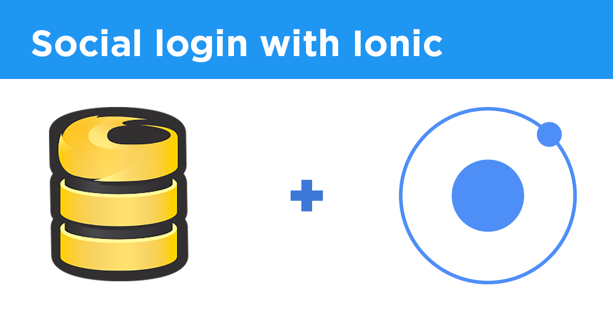

# SoftwareEngineeringProject

App to place orders at KFC, designed to be cross platform, so runs on a web, android or iOS

#Built on Ionic Framework



##Utilizes firebase for backend for social login and other features 


### Install dependencies

#### Quick-start (for experienced users)

With Node.js installed, run the following one liner from the root of your Polymer Starter Kit download:

```sh
npm install -g gulp bower && npm install && bower install
```

#### Prerequisites (for everyone)

The kfcApp requires the following major dependencies:

- Node.js, used to run JavaScript tools from the command line.
- npm, the node package manager, installed with Node.js and used to install Node.js packages.
- gulp, a Node.js-based build tool.
- bower, a Node.js-based package manager used to install front-end packages (like ionic).

**To install dependencies:**

1)  Check your Node.js version.

```sh
node --version
```

The version should be at or above 0.12.x.

2)  If you don't have Node.js installed, or you have a lower version, go to [nodejs.org](https://nodejs.org) and click on the big green Install button.

3)  Install `gulp` and `bower` globally.

```sh
npm install -g gulp bower
```

This lets you run `gulp` and `bower` from the command line.

4 )Install ionic globally

```sh
npm install -g ionic
```

### Development workflow

#### Serve / watch

```sh
cd.. 
ionic serve
```

This outputs an IP address you can use to locally test and another that can be used on devices connected to your network.


